# Notes
I might not appear "active" on Github as I spent most of the time on Gitlab for the past few months.

# About
```JavaScript
const greeting = "Hellooo world! I'm Cindy Lin!😃 I'm a frontend developer who loves developer memes & longboarding."
```

## Skills 🌱: 
JavaScript (ES6+), TypeScript, React/Redux, Bulbasaur, Charmander, TanStack Query, Gatsby, Next.js, ThreeJS, CSS, SASS, styled-components, TailwindCSS, Squirtle, Semantic-UI, Radix-UI, Ant Design, Mantine UI, Node.js, Express.js, Python, Git, pnpm, volta, Vite

( Can you spot 🔍 the pokemon characters above  ) 

## Learning / To Learn :
- Mobile Development ( React Native, Expo, Flutter, Swift )
- Desktop App Development ( Electron )
- Docker, Nginx Basics 

## Testing Markdown
This is for my future self so that I can create issue or PR in pretty format
> [!NOTE]
> This a pretty cool note

> [!TIP]
> This is a tip

> [!IMPORTANT]
> This is important

> [!WARNING]
> Warnning

> [!CAUTION]
> YOYO watch out


# How I got here? 
( graph created with [mermaid](https://github.com/mermaid-js/mermaid) )

```mermaid

flowchart LR


B("a Psychology Graduate,
Not sure what to do with life
Found an online Web Dev Course
")

C("Fall in ❤ with CSS")

B --> C

D("
I know it's challenging, BUT
I want to become a developer
")
C --> D

D --> |hard work|E(((Land my first dev job)))
```




## 21-Day Coding Challenge Website
Interested in learning about Web Development? Or know someone who might be interested in learning the fundamentals of Web Development? 
You are in the right place! 

Check out my free [21-Day Coding Adventure Website](https://21-day-coding-adventure.netlify.app/) to get started! ( No signup needed! )


## My Blog Posts: 
- [My Coding Journey: How I got here, my struggles, mistakes, and lessons learned](https://zerotomastery.io/blog/coding-journey-struggles-mistakes-lessons-learned)
- [Learn to Code](https://zerotomastery.io/blog/can-anyone-learn-to-code/)
- [Tutorial: How to Create Your Own Discord Bot?](https://coding-corgi.hashnode.dev/create-your-own-discord-bot-and-deploy-it-for-free)


## My NPM Package & VS Code Extension
- [mean-duck npm package](https://www.npmjs.com/package/mean-duck)
- [ZTM Blog Search Extension](https://marketplace.visualstudio.com/items?itemName=cutecorgi.ztm-blog). You can check the [code](https://github.com/LanguageXange/vscode) here.

## Life in a nutshell:


### Fun Fact⚡:
I know how to play the'thumb piano'! Don't know what that is? Well, Google it!

<br/>

  

<br/>


### Check out the link below to create your stats!

(https://github.com/anuraghazra/github-readme-stats)

### Check out the link below to see how many people view your profiles!
(https://github.com/antonkomarev/github-profile-views-counter)

### Check out the link to create your own badges! 
(https://shields.io/)
 

<!--
**LanguageXange/LanguageXange** is a ✨ _special_ ✨ repository because its `README.md` (this file) appears on your GitHub profile.

Here are some ideas to get you started:

-  I’m currently working on ...
-  I’m currently learning ...
- 👯 I’m looking to collaborate on ...
- 🤔 I’m looking for help with ...
- 💬 Ask me about ...
- 📫 How to reach me: ...
- 😄 Pronouns: ...
-  Fun fact: ...
-->
